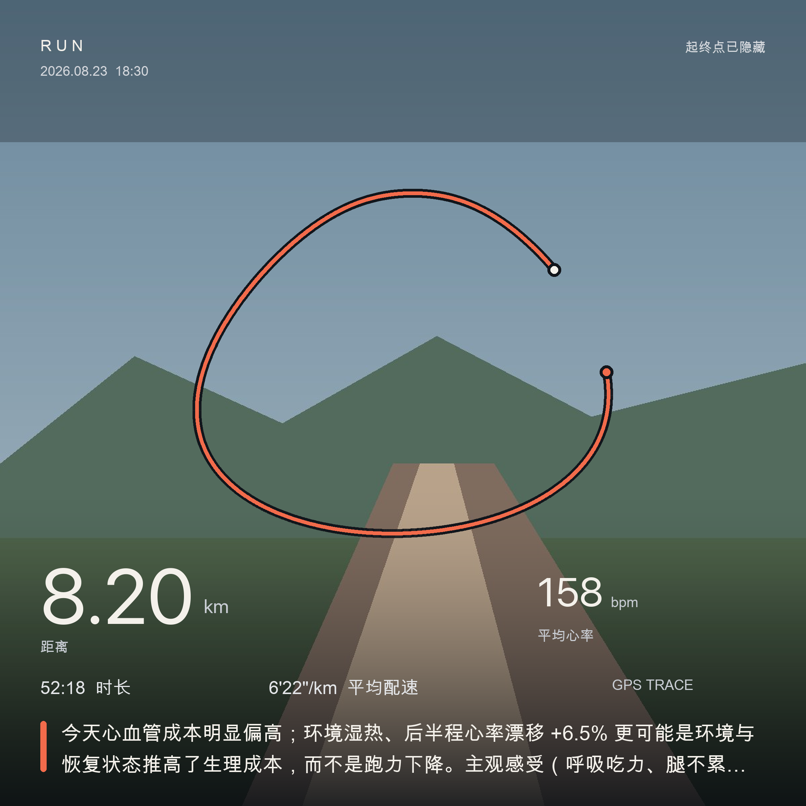

# 耐力运动解释引擎

> **A local-first endurance workout explanation engine built around your own history.**

## 明明和上次跑得差不多，为什么今天感觉完全不一样？

你跑了熟悉的距离，配速也没有明显变化，但今天心率更高、呼吸更急，或者腿比平时更沉。
有时又恰好相反：同样的路线突然变得很轻松。

这类起伏很难只靠运动手表上的一排数字解释。你真正想知道的是：

1. **今天到底哪里变了？**
2. **是天气、睡眠、近期训练、肌肉疲劳、手表记录，还是跑力真的发生了变化？**
3. **下一次应该调整训练，还是正常恢复后再观察？**

`endurance-health-analyst` 会把 Apple Watch / Apple Health 记录、当天环境、主观感受和你自己的历史训练放到同一条证据链里，给出一句可理解的结论和下一步动作，外加一张保护路线隐私的分享卡。

它是一名**专业运动健康分析助理**，不是医生，也不提供疾病诊断。


---

## 它会给你什么答案

假设一次 5 km 跑步比平时更累，平均心率也高了 8 bpm。它不会直接说“你退步了”，而是按顺序检查：

| 要检查的证据 | 它会回答什么 |
|---|---|
| 本次运动 | 配速是否稳定？后半程心率是否持续上升？是连续跑还是跑走间歇？ |
| 身体响应 | 同配速心率、HR Drift、HRR60/120 和心率区间发生了什么？ |
| 当天环境 | 气温、湿度、体感温度、露点和风是否增加了生理成本？ |
| 恢复背景 | 前一晚睡眠、静息心率、HRV 和近 7 天跑量是否支持这次训练？ |
| 主观感受 | 是呼吸吃力、腿部疲劳、局部不适，还是整体感觉正常？ |
| 个人历史 | 和距离、配速、天气相近的历史训练相比，今天真的偏离基线了吗？ |

最终输出保持很短：

> **一句话**：今天同配速下的心率高于个人基线；湿热环境和偏短睡眠更可能推高了生理成本，单次结果还不足以判断跑力下降。
>
> ❤️ 心血管：同配速心率比个人基线 +8 bpm<br>
> 🌡 环境：30°C / RH 78%，湿热负荷较高<br>
> ⚡ 表现：稳定段 HR Drift +6.5%<br>
>
> **下一步**：下一次轻松跑按心率或 RPE 控制强度；换到凉爽时段复测相同配速。

比较标尺永远是**过去的你**，不是陌生人的平均值。

---

## 从解释到照护，再到记录

一次训练结束后，这个 Skill 可以继续完成两件轻量但容易被忽略的事。

### 1. 记录并提醒跑后放松

记录需要放松的肌群、当前紧张/酸胀程度、温和清单和完成情况。macOS 用户可以把提醒写入“提醒事项”，再通过 iCloud 同步到 iPhone 和 Apple Watch。

```bash
PY=.venv/bin/python

$PY scripts/manage_recovery.py create \
  --workout latest:run \
  --muscles calves,quads,glutes \
  --routine post_run_basic \
  --duration-min 10 \
  --soreness-before 5 \
  --remind-at 2026-08-24T21:30:00+08:00 \
  --reminder-backend macos \
  --json

# 完成后记录变化
$PY scripts/manage_recovery.py complete \
  --plan recovery_ab12 \
  --soreness-after 2 \
  --note "小腿明显放松" \
  --json
```

放松清单只包含轻松走动、舒适范围内的活动和轻柔放松。尖锐疼痛、明显肿胀或持续加重的不适不适合靠这套清单处理。

### 2. 生成一张朋友圈方形分享卡



卡片以你上传的照片为主角，把**已经隐藏敏感起终点**的 GPS 轨迹投影到画面中，再保留距离、平均心率、时长、配速和一句话结论。

```bash
$PY scripts/render_card.py \
  --workout latest:run \
  --photo ~/Pictures/today-run.HEIC \
  --privacy on
```

输出：`output/workout-card.png`，尺寸为 **2160 × 2160**。

- 支持 JPEG、PNG、HEIC；自动处理 iPhone 照片方向并移除 EXIF/GPS 元数据。
- 路线是本次运动的真实 GPS 轨迹；透视只用于视觉呈现，不伪造道路、建筑或三维地形。
- 没有照片时会生成方形路线版；损坏照片会明确报错，不会偷偷降级。
- 照片画面本身仍可能暴露人物或地标，分享前需要自行确认。

---

## 30 秒开始使用

```bash
git clone https://github.com/bor799/endurance-health-analyst.git
cd endurance-health-analyst
./setup.sh
cp data/config.example.json data/config.json  # 可选：填写 age / max_hr / lthr

PY=.venv/bin/python
```

在 iPhone 中打开“健康”App：头像 → 导出所有健康数据，得到 `export.zip`。

```bash
# 1. 导入 Apple Health
$PY scripts/ingest_apple_health.py ~/Downloads/export.zip

# 2. 补齐天气
$PY scripts/enrich_weather.py --all-missing

# 3. 分析最近一次跑步
$PY scripts/analyze_workout.py --workout latest:run \
  --rpe 7 \
  --breathing hard \
  --legs tired \
  --pain none \
  --feeling "配速和平时差不多，但今天后半程明显更累"

# 4. 看趋势
$PY scripts/compare_history.py --trend

# 5. 生成照片分享卡
$PY scripts/render_card.py --workout latest:run \
  --photo ~/Pictures/today-run.HEIC --privacy on
```

COROS 用户也可以导入秒级 FIT 文件：

```bash
$PY scripts/ingest_fit.py ~/Downloads/*.fit
```

同一时间附近的重复运动会按来源优先级自动去重。

---

## 四个产物，各自解决一个问题

| 文件 | 用途 |
|---|---|
| `output/workout.json` | 统一保存本次运动、环境和恢复背景 |
| `output/analysis.json` | 回答“今天为什么不一样”，包含一句话、三个信号、建议和个人基线 |
| `output/report.html` | 查看 Pace × HR 时间线、心率区间和相似历史训练 |
| `output/workout-card.png` | 照片主角的 1:1 朋友圈分享卡 |

健康数据保存在本地 DuckDB：`data/health.duckdb`。数据库和 `output/` 运行产物已被 `.gitignore` 排除。渲染器只读取照片，不会把外部照片复制进仓库；请把真实照片保存在仓库之外，或放进专门忽略的 `private-photos/`。

---

## 它如何避免把一次波动说成“你退步了”

- **EF 有氧效率**：稳定段 speed/HR，只做个人纵向比较。
- **HR Drift**：过滤热身、冷身、停车、明显坡度和间歇切换；配速不稳时标记为不可解释。
- **HRR60/120**：间歇训练会识别最后一段强度后的恢复锚点；只描述恢复过程，不用于诊断。
- **Z1-Z5**：实验室阈值 > LTHR > 用户配置的 `max_hr` > 个人历史最大心率 > 220-age；历史最大值和年龄公式必须标记 `estimated`，配置值则明确标为 `configured_max_hr`。
- **相似训练**：优先匹配运动类型、距离、配速、气温与湿度，再查看 7/28/90/365 天和全历史窗口。
- **基线不足时保持沉默**：样本太少就明确说“暂时无法比较”，不编造趋势。

公式与有效性条件见 [`references/metrics.md`](references/metrics.md)。

---

## 隐私与医疗边界

### 隐私默认开启

- 分享卡默认裁掉起点和终点附近约 300 m 的 GPS。
- 短路线或裁剪后没有安全点时，路线会完全隐藏，绝不回退原坐标。
- 渲染器只接收局部 XY 路径，不接触经纬度。
- 照片会去除 EXIF/GPS，HTML 不包含原始照片路径。
- 天气查询会向 Open-Meteo 发送运动时间和一个定位坐标。优先使用本次路线中部；本次没有路线时，会自动借用前后 60 天内时间最近的已定位训练坐标，并在天气记录中标注 `position_source`。

### 它不能替代医生

穿戴设备适合观察运动趋势，但不足以诊断疾病。这个项目不会根据心率、HRV、HRR 或主观描述输出心脏、心律失常、损伤或其他疾病结论。

当异常数据同时伴随胸部不适、心悸、头晕或无法解释的呼吸困难时，只提示：

> 该表现无法仅通过运动数据解释，建议停止高强度运动并考虑专业医学评估。

---

## 已验证

合成数据端到端验收当前为 **38 passed / 0 failed**：

```text
Apple Health export.zip
→ 跨来源去重
→ GPS + HR + Pace
→ Open-Meteo 天气
→ HR Drift / HRR / Zones / EF
→ 相似历史训练
→ 一句话解释
→ 照片 + 隐私轨迹
→ 2160×2160 分享卡
```

另外已用真实 HealthKit Export v14 验证 4 年数据导入路径。真实数据库、GPS、照片和分析产物不进入公开仓库。

运行测试：

```bash
.venv/bin/python -m unittest discover -s tests -p 'test_*.py'
.venv/bin/python tests/e2e_test.py
```

## 目录

```text
endurance-health-analyst/
├── SKILL.md                 # Agent 触发与命令路由
├── scripts/
│   ├── ingest_apple_health.py
│   ├── ingest_fit.py
│   ├── enrich_weather.py
│   ├── analyze_workout.py
│   ├── compare_history.py
│   ├── manage_recovery.py
│   ├── render_card.py
│   └── card_visual.py
├── references/              # 指标、数据格式、分享卡与放松边界
├── templates/               # 报告与卡片 HTML
├── docs/assets/             # 仅包含合成数据示例
├── data/                    # 本地 DuckDB 与配置（真实数据库不入库）
└── tests/                   # 单元测试 + 合成数据 E2E
```

## License

MIT
